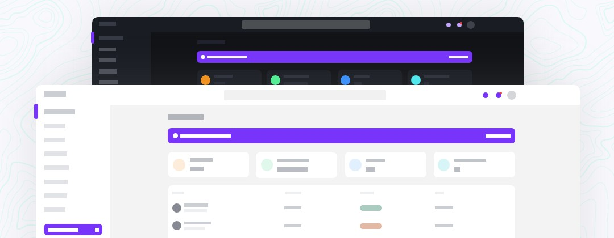

<p align="center">
    <h1>Windmill Dashboard Next.js Typescript</h1>
      
    <br>
</p>


## 📦 Features

- 🦮 Throughly accessible (developed using screen readers)
- 🌗 Dark theme enabled (load even different images based on theme)
- 🧩 Multiple (custom) components
- ⚡ Code splitting
- Tailwind CSS
- [Windmill React UI](https://windmillui.com/react-ui)
- Heroicons
- Chart.js
## Getting Started

First, install dependencies :
```bash
npm install
# or
yarn install
```

then, you can run the development server:

```bash
npm run dev
# or
yarn dev
    <a href="https://windmill-dashboard-nextjs-typescript.vercel.app/example">
```

Open [http://localhost:3000](http://localhost:3000) with your browser to see the result.
]